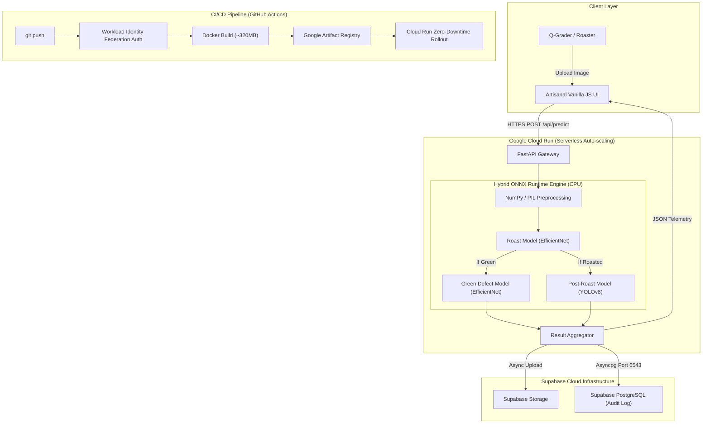

# ☕ BeanSight
### **B2B Quality Assurance Studio for Specialty Coffee Telemetry**

[](https://coffee-bean-analyzer-876034946934.us-central1.run.app)
[](https://www.python.org/)
[](https://fastapi.tiangolo.com/)
[](https://onnxruntime.ai/)
[](https://www.docker.com/)
[](https://supabase.com/)
[](https://github.com/anoopsachdev/BeanSight/actions)

<p align="center">
  <strong>An end-to-end edge-optimized deep learning system designed for the specialty coffee industry. BeanSight utilizes a tiered Hybrid ONNX Engine (EfficientNet + YOLOv8) to automate both green coffee micro-grading and post-roast batch uniformity screening in ~150ms.</strong>
</p>

[**Explore Live Web Application »**](https://coffee-bean-analyzer-876034946934.us-central1.run.app)

---

## 💡 Domain-Driven Design for Coffee QA

In the specialty coffee industry, quality control happens in two distinctly different environments. Human evaluators (Q-Graders) manually inspect green coffee for micro-defects, while roasters visually inspect post-production batches for scorches and quakers.

BeanSight is engineered to map directly to these real-world workflows with a **Tiered Quality Assurance** pipeline:

### Tier 1: Inbound Green Coffee (Micro-Grading)
* **The Goal:** Instantly verify green bean lot quality before committing to expensive production roasts.
* **The Engine:** An **EfficientNet-B0** classifier trained on a 17-class severity spectrum (e.g., Fungus, Insect Damage, Withered, Dry Cherry).
* **The Output:** A 0-100 SCAA standard Quality Score and probability distribution.

### Tier 2: Post-Roast Production (Batch Screening)
* **The Goal:** High-throughput batch evaluation for roast consistency and thermal defects.
* **The Engine:** A **YOLOv8** object detection model localized for roasted coffee.
* **The Output:** Batch Uniformity %, defect count (Scorched, Quaker, Broken), and an annotated bounding-box localization image.

---

## ⚡ Engineering Problem-Solving & "Zero Heavy ML"

> *"The goal wasn't just to build a model that worked in a Jupyter Notebook; the challenge was building a production-ready, edge-optimized application with zero GPU dependency for serverless deployment."*

```
Traditional ML Deployment                BeanSight Optimized Architecture
┌───────────────────────────────┐        ┌───────────────────────────────┐
│  PyTorch 2.3 + TorchVision    │        │  Pillow + NumPy Preprocessing │
│  CUDA Libraries & Bloat       │   →    │  ONNX Runtime (CPU Provider)  │
│  Container Size: ~4.2 GB      │        │  Container Size: ~320 MB      │
│  Cold Start: 12-18 seconds    │        │  Cold Start: < 1.2 seconds    │
│  Inference: 450ms (CPU)       │        │  Inference: ~150ms (CPU)      │
└───────────────────────────────┘        └───────────────────────────────┘
```

### 1. PyTorch to ONNX Graph Optimization
Standard PyTorch container deployments require 4GB+ Docker images and heavy memory overhead. By exporting the models to **ONNX computation graphs** and serving inference through **ONNX Runtime (CPU Execution Provider)**:
* Stripped `torch`, `torchvision`, and `ultralytics` from production dependencies.
* Slashed container footprint from **~4.2GB down to ~320MB** (a **92% reduction**).
* Kept inference latency to **~150ms** on serverless Cloud Run instances despite running two sequential deep learning models on a single CPU core.

### 2. Non-Blocking FastAPI Lifespan
Cloud Run automatically checks port bindings to determine container health. Loading three ONNX models into memory synchronously blocks the `asyncio` event loop. BeanSight solves this by utilizing `asyncio.to_thread()` and background tasks during the FastAPI lifespan to parse the models lazily—ensuring the application binds to `$PORT` and passes health checks in `<250ms`.

### 3. Asynchronous Telemetry & Resilient Persistence
* **Non-blocking logging:** Predictions compute and return immediately while image uploads (Supabase Storage) and audit logging (Supabase PostgreSQL via `asyncpg`) execute concurrently as best-effort tasks.
* **pgBouncer pooler compatibility:** Configured SQLAlchemy async engine with `statement_cache_size=0` to support transaction-mode database pooling on port `6543`.

---

## 🏗️ System Architecture



---

## 🛠️ Technology Stack Matrix

```
Machine Learning & Inference
├── Training: PyTorch 2.3, Ultralytics, TorchVision
├── Model Architecture: Hybrid (EfficientNet-B0 + YOLOv8)
├── Production Inference: ONNX Runtime 1.18 (CPU Execution Provider)
└── Preprocessing: Pillow (PIL) + NumPy

Backend & API Architecture
├── Web Framework: FastAPI 0.111 (Python 3.11)
├── Server: Uvicorn (ASGI async worker)
└── Rate Limiting: SlowAPI (X-Forwarded-For proxy tracking)

Cloud Infrastructure & Database
├── Compute: Google Cloud Run (Serverless, auto-scaling)
├── Database: Supabase PostgreSQL (SQLAlchemy 2.0 + asyncpg)
└── Object Storage: Supabase Storage S3-compatible bucket

DevOps & Security
├── CI/CD: GitHub Actions (Automated build & deployment)
├── Cloud Security: Workload Identity Federation (Keyless GCP Auth)
└── Frontend: Vanilla JS/CSS (Artisanal B2B Aesthetic)
```

---

## 📡 Production API Reference

### `POST /api/predict`
Uploads a coffee sample for intelligent tiered routing. The response automatically adapts based on whether the sample is unroasted or roasted.

**Example Response (Tier 1: Green Bean):**
```json
{
  "roast": {
    "prediction": "Green",
    "confidence": 0.99
  },
  "defect": {
    "type": "green_agricultural",
    "prediction": "Insect Damage",
    "confidence": 0.88,
    "probabilities": { ... }
  },
  "inference_time_ms": 142.17,
  "image_url": "https://[...].supabase.co/storage/v1/object/public/coffee-uploads/bean_c50afd.jpg"
}
```

**Example Response (Tier 2: Roasted Batch):**
```json
{
  "roast": {
    "prediction": "Medium",
    "confidence": 0.95
  },
  "roasted_defect": {
    "type": "roasted_mechanical",
    "defect_count": 2,
    "defect_summary": {
      "Quaker": 2
    },
    "detections": [...],
    "annotated_image": "data:image/jpeg;base64,/9j/4AAQSkZJRg..."
  },
  "inference_time_ms": 165.40,
  "image_url": "https://[...]"
}
```

### Additional Endpoints
* `GET /health` — Returns status of ONNX models in memory and API uptime.
* `GET /api/history?limit=20` — Retrieves recent logged quality evaluations.
* `GET /api/stats` — Summary metrics (total evaluated, defect distribution).

---

## 💻 Local Quickstart Guide

### Option 1: Docker (Recommended)

```bash
# 1. Clone repository
git clone https://github.com/anoopsachdev/BeanSight.git
cd BeanSight

# 2. Configure environment variables
cp .env.example .env

# 3. Build & Run Docker container
docker build -t beansight .
docker run -p 8080:8080 --env-file .env beansight

# 4. Open application
open http://localhost:8080
```

### Option 2: Python Virtual Environment

```bash
# 1. Setup virtual environment
python3.11 -m venv .venv
source .venv/bin/activate

# 2. Install production dependencies
pip install --upgrade pip
pip install -r requirements.txt

# 3. Launch development server with reload
uvicorn app.main:app --host 0.0.0.0 --port 8080 --reload
```

---

## 🔒 Security & Workload Identity Federation (WIF)

BeanSight's CI/CD pipeline implements enterprise-grade **Keyless Authentication** using Google Cloud Workload Identity Federation. No long-lived service account JSON keys are stored in GitHub Secrets.

```yaml
# Sample from .github/workflows/deploy.yml
- name: Authenticate to Google Cloud
  uses: google-github-actions/auth@v2
  with:
    workload_identity_provider: ${{ secrets.WIF_PROVIDER }}
    service_account: ${{ secrets.WIF_SERVICE_ACCOUNT }}
    token_format: 'access_token'
```

---

## 👨‍💻 Author

**Anoop Singh Sachdev**  
*Computer Vision & Deep Learning Engineer*  
*Specialty Coffee Enthusiast & System Architect*

* GitHub: [@anoopsachdev](https://github.com/anoopsachdev)
* Project Repo: [BeanSight](https://github.com/anoopsachdev/BeanSight)
* Live Cloud Run Instance: [BeanSight Web Service](https://coffee-bean-analyzer-876034946934.us-central1.run.app)

---

<div align="center">
  <sub>Built with passion for specialty coffee roasters worldwide. Licensed under the MIT License.</sub>
</div>
