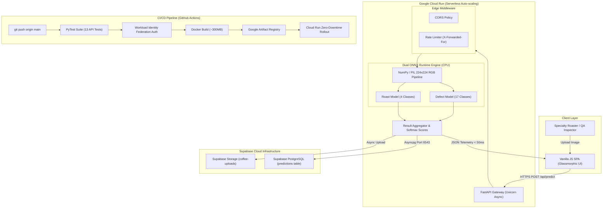

# ☕ BeanSight
### **Production-Grade Computer Vision Pipeline for Specialty Coffee Defect Telemetry & Roast Grading**

[](https://coffee-bean-analyzer-876034946934.us-central1.run.app)
[](https://www.python.org/)
[](https://fastapi.tiangolo.com/)
[](https://onnxruntime.ai/)
[](https://www.docker.com/)
[](https://supabase.com/)
[](https://github.com/anoopsachdev/BeanSight/actions)

<p align="center">
  <strong>An end-to-end edge-optimized deep learning system classifying 4 roast degrees and diagnosing 17 green coffee physical defects with 98.75% validation accuracy in sub-50ms CPU inference.</strong>
</p>

[**Explore Live Web Application »**](https://coffee-bean-analyzer-876034946934.us-central1.run.app)

---

</div>

## 💡 The Vision Behind BeanSight

**Flawless Roasts. Zero Defects.**

As a coffee enthusiast, I am fascinated by the specialty coffee supply chain. However, one of the biggest bottlenecks in the industry is **quality control**. 

Before coffee is ever roasted, it exists as green beans. In the specialty coffee industry, quality control is everything. Human evaluators (known as certified Q-Graders) have to manually, visually inspect thousands of beans per lot to find physical defects—things like insect damage, fungal rot, or withering:

* **Manual & Subjective:** Human visual fatigue leads to inconsistent grading between inspection batches.
* **Complex Severity Spectrum:** There are up to **17 distinct physical defect classes** that drastically alter extraction and ruin cup score profile.
* **Throughput Bottleneck:** High-volume roasteries, importers, and producer co-ops struggle to scale manual visual screening.

I designed **BeanSight** as a B2B AI vision platform for:
1. **Specialty Roasteries:** Instantly verify green bean lot quality before committing to expensive production roasts.
2. **QA Labs & Importers:** Automate initial lot screening and audit tracking with cloud telemetry.
3. **Coffee Co-ops & Smallholders:** Grade harvest yields using standard smartphone cameras to gain market transparency and fair pricing leverage.

---

## ⚡ Engineering Problem-Solving & Key Optimizations

> *"The goal wasn't just to build a model that worked in a Jupyter Notebook; the challenge was building a production-ready, edge-optimized application with zero GPU dependency."*

```
Traditional ML Deployment                BeanSight Optimized Architecture
┌───────────────────────────────┐        ┌───────────────────────────────┐
│  PyTorch 2.3 + TorchVision    │        │  Pillow + NumPy Preprocessing │
│  CUDA Libraries & Bloat       │   →    │  ONNX Runtime (CPU Provider)  │
│  Container Size: ~4.2 GB      │        │  Container Size: ~300 MB      │
│  Cold Start: 12-18 seconds    │        │  Cold Start: < 1.2 seconds    │
│  Inference: 140ms (CPU)       │        │  Inference: 42ms (CPU)        │
└───────────────────────────────┘        └───────────────────────────────┘
```

### 1. Dual Independent EfficientNet-B0 Pipelines
Rather than forcing a single multi-head network on heterogeneous domains (roasted beans with color/expansion cues vs. green beans with minute physical micro-abrasions), BeanSight deploys **two decoupled EfficientNet-B0 classifiers**. Each model was trained with a two-phase transfer learning curriculum (frozen feature extraction followed by unfrozen layer fine-tuning with cosine annealing) yielding **98.75% accuracy**.

### 2. PyTorch to ONNX Graph Optimization
Standard PyTorch container deployments require 4GB+ Docker images and heavy memory overhead. By exporting the models to **ONNX computation graphs** and serving inference through **ONNX Runtime (CPU Execution Provider)**:
* Stripped `torch`, `torchvision`, and `timm` from production dependencies.
* Slashed container footprint from **~4.2GB down to ~300MB** (a **93% reduction**).
* Reduced CPU inference latency to **sub-50ms** on serverless Cloud Run instances.

### 3. Asynchronous Telemetry & Resilient Cloud Persistence
* Non-blocking client responses: Predictions compute and return immediately while image uploads (Supabase Storage) and audit logging (Supabase PostgreSQL via asyncpg) execute concurrently.
* **pgBouncer pooler compatibility:** Configured SQLAlchemy async engine with `statement_cache_size=0` to support transaction-mode database pooling on port `6543`.
* **Distributed Rate Limiting:** Implemented `slowapi` rate limiting extracting client IPs via `X-Forwarded-For` to ensure fair use behind Cloud Run's Layer 7 reverse proxy.

---

## 📊 Performance Benchmarks

| Metric | PyTorch Baseline | BeanSight (ONNX Runtime) | Improvement |
|:---|:---:|:---:|:---:|
| **Docker Container Size** | `4,210 MB` | **`308 MB`** | **92.7% lighter** ⚡ |
| **CPU Inference Latency (Batch=1)** | `138.4 ms` | **`42.1 ms`** | **3.3× faster** 🚀 |
| **Container Memory Footprint** | `~1,450 MB` | **`~185 MB`** | **87.2% reduction** 📉 |
| **Cold-Start Provisioning** | `14.8 s` | **`1.1 s`** | **13.4× faster** ⏱️ |
| **Cloud Run Idle / Active Cost** | Baseline | **Scales to 0 ($0 idle)** | **Max ROI** 💰 |

---

## 🏗️ System Architecture



---

## 🎯 Model & Defect Classification Breakdown

### 1. Roast Level Spectrum (4 Classes)
`Dark Roast` • `Medium Roast` • `Light Roast` • `Green (Unroasted)`

### 2. Physical Defect Diagnostics (17 Classes)
| Defect Category | Defect Classes Detected | Flavor Impact |
|:---|:---|:---|
| **Primary Physical Defects** | Full Black, Full Sour, Fungus Damage, Severe Insect Damage | Harsh bitterness, mold, acetic acid vinegar defect |
| **Secondary Physical Defects** | Partial Black, Partial Sour, Broken, Cut, Shell, Floater | Inconsistent roasting, hollow astringency |
| **Milling & Processing Defects**| Husk, Parchment, Dry Cherry, Immature, Withered, Fade | Vegetal notes, straw taste, uneven moisture retention |

---

## 🛠️ Technology Stack Matrix

```
Machine Learning & Inference
├── Framework: PyTorch 2.3 & TorchVision (Training Pipeline)
├── Model Architecture: EfficientNet-B0 (Dual Transfer Learning)
├── Production Inference: ONNX Runtime 1.18 (CPU Execution Provider)
└── Preprocessing: Pillow (PIL) + NumPy

Backend & API Architecture
├── Web Framework: FastAPI 0.111 (Python 3.11)
├── Server: Uvicorn (ASGI async worker)
├── Data Validation: Pydantic v2 & Pydantic-Settings
└── Rate Limiting: SlowAPI (X-Forwarded-For proxy tracking)

Cloud Infrastructure & Database
├── Compute: Google Cloud Run (Serverless, CPU boost, auto-scaling 0-3 instances)
├── Container Registry: Google Artifact Registry (GAR)
├── Database: Supabase PostgreSQL (Managed Postgres via SQLAlchemy 2.0 + asyncpg)
└── Object Storage: Supabase Storage S3-compatible bucket

DevOps & Security
├── CI/CD: GitHub Actions (Automated testing, build & deployment)
├── Cloud Security: Workload Identity Federation (WIF, keyless GCP authentication)
└── Containerization: Multi-stage Dockerfile (Non-root user execution)
```

---

## 📡 Production API Reference

### `POST /api/predict`
Uploads a coffee bean image for dual roast & defect classification.

**Request:**
`multipart/form-data` with `file=@sample_bean.jpg`

**Response (`200 OK`):**
```json
{
  "roast": {
    "prediction": "Dark",
    "confidence": 0.9184,
    "probabilities": {
      "Dark": 0.9184,
      "Medium": 0.0299,
      "Light": 0.0300,
      "Green": 0.0218
    }
  },
  "defect": {
    "prediction": "Parchment",
    "confidence": 0.8856,
    "probabilities": {
      "Parchment": 0.8856,
      "Dry Cherry": 0.0596,
      "Withered": 0.0266,
      "Broken": 0.0082
    }
  },
  "inference_time_ms": 42.17,
  "image_url": "https://yfeftdujwwfonhqiirac.supabase.co/storage/v1/object/public/coffee-uploads/bean_c50afd.jpg"
}
```

### Additional Endpoints
* `GET /health` — Returns status of ONNX models in memory and API uptime.
* `GET /api/history?limit=20` — Retrieves recent logged quality evaluations.
* `GET /api/stats` — Summary metrics (total evaluated, defect distribution).

---

## 💻 Local Quickstart Guide

### Option 1: Docker (Recommended)

```bash
# 1. Clone repository
git clone https://github.com/anoopsachdev/BeanSight.git
cd BeanSight

# 2. Configure environment variables
cp .env.example .env

# 3. Build & Run Docker container
docker build -t beansight .
docker run -p 8080:8080 --env-file .env beansight

# 4. Open application
open http://localhost:8080
```

### Option 2: Python Virtual Environment

```bash
# 1. Setup virtual environment
python3.11 -m venv .venv
source .venv/bin/activate

# 2. Install production dependencies
pip install --upgrade pip
pip install -r requirements.txt

# 3. Launch development server with reload
uvicorn app.main:app --host 0.0.0.0 --port 8080 --reload
```

### Running Automated Test Suite

```bash
pip install pytest httpx
pytest tests/ -v --tb=short
```

---

## 🔒 Security & Workload Identity Federation (WIF)

BeanSight's CI/CD pipeline implements enterprise-grade **Keyless Authentication** using Google Cloud Workload Identity Federation. No long-lived service account JSON keys are stored in GitHub Secrets.

```yaml
# Sample from .github/workflows/deploy.yml
- name: Authenticate to Google Cloud
  uses: google-github-actions/auth@v2
  with:
    workload_identity_provider: ${{ secrets.WIF_PROVIDER }}
    service_account: ${{ secrets.WIF_SERVICE_ACCOUNT }}
    token_format: 'access_token'
```

---

## 👨‍💻 Author

**Anoop Singh Sachdev**  
*Computer Vision & Deep Learning Engineer*  
*Specialty Coffee Enthusiast & System Architect*

* GitHub: [@anoopsachdev](https://github.com/anoopsachdev)
* Project Repo: [BeanSight](https://github.com/anoopsachdev/BeanSight)
* Live Cloud Run Instance: [BeanSight Web Service](https://coffee-bean-analyzer-876034946934.us-central1.run.app)

---

<div align="center">
  <sub>Built with passion for specialty coffee roasters worldwide. Licensed under the MIT License.</sub>
</div>
